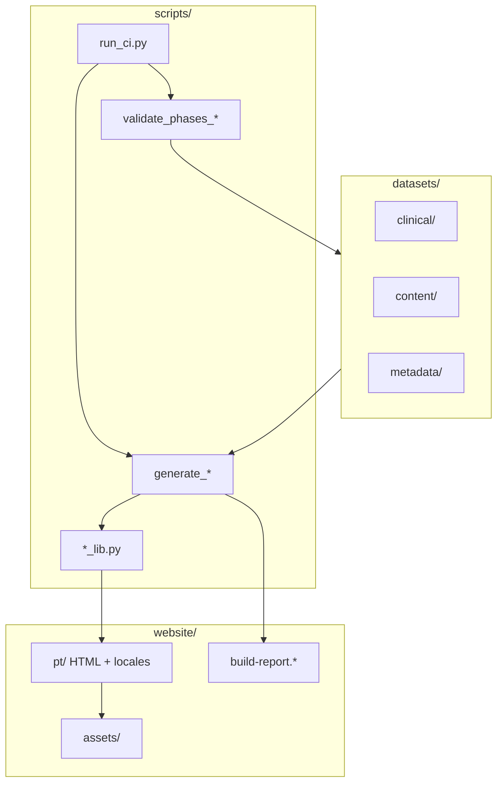

# 02 — Arquitetura

## Camadas

## Scripts principais

| Script | Papel |
|--------|-------|
| `generate_website_pt.py` | Orquestrador SSG — emite HTML pt-BR, locales, SEO pós-build |
| `seo_lib.py` | HEAD (canonical, hreflang, JSON-LD), localização HTML |
| `post_build_seo.py` | Sitemap, robots, RSS, search-index a partir do HTML gerado |
| `build_lib.py` | Relatório de build, amostra JSON-LD/a11y, zip de deploy |
| `website_lib.py` | Layout base, breadcrumbs, render de página |
| `tool_lib.py` | Páginas de ferramentas (formulários, escalas, PDF) |
| `medication_lib.py` | Hub e bulas de medicamentos |
| `templates_lib.py` | Bibliotecas NANDA/NIC/NOC |
| `dataset_io.py` | Leitura/escrita transparente de datasets shardados |
| `audit_website_pt.py` | Links quebrados, chrome, locales |
| `run_ci.py` | Pipeline unificado |

## Bibliotecas de renderização (`*_lib.py`)

Cada domínio de página tem uma lib dedicada que recebe registros do dataset e devolve HTML fragmentado:

- **chrome_lib** — cabeçalho, rodapé, mega-menu
- **hub_lib / institutional_lib** — hubs e páginas institucionais
- **article_lib / protocol_lib** — artigos e protocolos
- **tool_lib** — 100 ferramentas com templates (`TPL.SCALE_FORM`, `TPL.CALCULATOR`, etc.)

O ponto único de `<head>` SEO é `seo_lib.render_document()`.

## Assets front-end

Em `website/assets/`:

- **css/** — `tokens.css`, `layout.css`, `chrome.css`, `tools.css`
- **js/site.js** — busca, cookies, ferramentas clínicas (cálculo client-side)
- **data/search-index.json** — índice gerado no pós-build

Locales compartilham assets na raiz (`../assets/…`); apenas o HTML é duplicado por locale.

## Metadados operacionais

| Arquivo | Uso |
|---------|-----|
| `datasets/metadata/ci_report.json` | Última execução do CI |
| `datasets/metadata/pendencies_status.json` | Pendências e itens resolvidos |
| `website/build-report.json` | Métricas do último build |
| `website/pt/generation_manifest.json` | Lista de páginas geradas |

## Próximo documento

→ [03-datasets.md](03-datasets.md)
