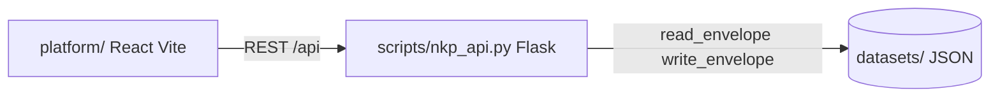

# 07 — Calculadoras de Enfermagem Knowledge Platform

Admin React para gestão do grafo de conhecimento e pipeline de conteúdo, compatível com os datasets JSON do CALENF-NKD.

## Arquitetura



## Identidade visual

A UI reutiliza os **design tokens** do site (`website/assets/css/tokens.css`):

- Primária: verde esmeralda (`--primary-500` … `--primary-800`)
- Sidebar: navy (`--navy-950`)
- Tipografia: Inter
- Logotipo: `logotipo_website.webp` (mesmo asset do site)

## Entidades expostas

| API key | Dataset |
|---------|---------|
| MasterEntity | master/master_entities.json |
| EntityRelation | master/entity_relations.json |
| Asset | metadata/assets.json |
| PageTemplate | metadata/templates.json |
| Section | metadata/sections.json |
| Component | metadata/components.json |
| ComplianceRule | metadata/compliance_rules.json |
| ContentRequest | content/content_requests.json |
| Workflow | ai/workflows.json |

A API **normaliza** campos do dataset para o formato do grafo UI:

- `source_code` → `source_entity`
- `target_code` → `target_entity`
- `weight` → `strength` (1–10)

## Quick start

```bash
# 1. API Python
pip install -r requirements-nkp.txt
python scripts/nkp_api.py
# http://127.0.0.1:8787/api/health

# 2. UI React
cd platform
npm install
npm run dev
# http://localhost:5175
```

## Páginas

| Rota | Função |
|------|--------|
| `/` | Dashboard + contagens |
| `/relations` | Grafo + tabela de relações |
| `/mind-map` | Mapa mental (amostra MasterEntity) |
| `/content-requests` | Kanban Content Factory |
| `/master-entities`, `/assets`, … | CRUD list (paginado) |

## Endpoints REST

```
GET  /api/stats
GET  /api/entities/{Entity}?search=&limit=&offset=
GET  /api/entities/{Entity}/{id}
POST /api/entities/{Entity}
PUT  /api/entities/{Entity}/{id}
GET  /api/graph/relations?limit=&search=
GET  /api/graph/mindmap?master_limit=&domain=
```

## Schemas de referência (CMS)

Os schemas Asset, MasterEntity, Template, Section, Component, ContentRequest, ComplianceRule, Workflow e EntityRelation mapeiam para os datasets existentes. Campos extras do CMS (ex.: `file_url`, `license`, `ai_prompt`) podem ser adicionados aos registros via POST/PUT sem alterar o gerador estático.

## Próximos passos sugeridos

1. Formulários de criação/edição (EntityFormDialog)
2. Sugestões inteligentes de relacionamentos (opcional)
3. Sincronizar assets da home com `metadata/assets.json`
4. Autenticação local para ambiente de produção

→ [README.md](../README.md)
