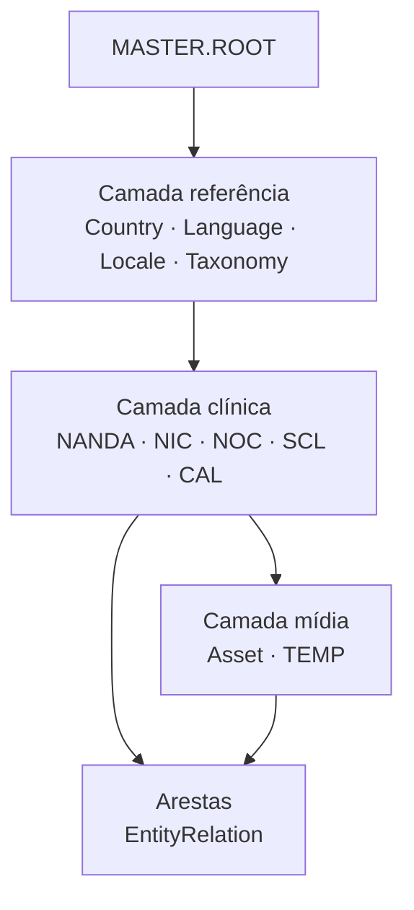
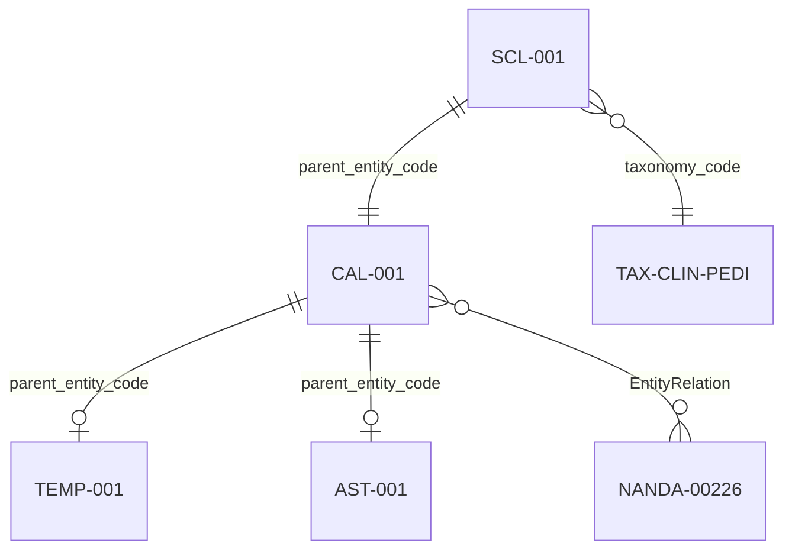

# 13 — Master Data: banco oficial, proveniência e integridade

Planejamento para construir a **base mestre completa do grafo NKOS** a partir de **órgãos e normas oficiais**, com documentação de campo, validação ≥99% e UI exclusivamente por **referência** (select, checkbox, tags).

Relacionado: [07-plataforma-nkp.md](07-plataforma-nkp.md) · [08-particionamento-lazy-loading.md](08-particionamento-lazy-loading.md) · [03-datasets.md](03-datasets.md) · [clinical-engine/04-validacao-datasets.md](clinical-engine/04-validacao-datasets.md)

---

## 1. Objetivo

| Meta | Descrição |
|------|-----------|
| **Banco mestre único** | Um hub *Master Data* onde todos os **nós** (entidades) e **arestas** (relações) são criados antes do grafo operacional |
| **Fontes oficiais** | Cada registro rastreável a norma, catálogo ou publicação reconhecida |
| **Integridade ≥99%** | Validação automática + amostragem manual contra fonte canônica |
| **UI por referência** | Nenhum vínculo digitado à mão — apenas menu suspenso, combobox, checkbox ou tags |
| **Identidade dupla** | `uuid` imutável + `entity_code` legível e hierárquico (pai → filho) |
| **Ativos visíveis** | Ícones, bandeiras e imagens sempre com **thumbnail** na lista, preview e formulário |

---

## 2. Princípios de modelagem

### 2.1 Todo registro é um nó do grafo



### 2.2 Identificadores obrigatórios

| Campo | Tipo | Regra |
|-------|------|-------|
| `uuid` | UUID v4 | Gerado uma vez; nunca reutilizado; chave técnica global |
| `entity_code` | string | Chave de negócio **única** no banco; usada em FKs e na UI |
| `parent_entity_code` | FK → `entity_code` | Todo nó (exceto `MASTER.ROOT`) aponta para o pai |
| `status` | enum | `draft` → `review` → `published` → `archived` |
| `content_source` | enum | `OFFICIAL` · `NKOS_CURATED` · `NKOS_CUSTOM` |
| `provenance` | objeto | Fonte, URL, versão, data de extração, hash (ver §6) |

**Regra de ouro:** módulos downstream (Design System, Compliance, Content Factory) **só consomem** códigos `published` via picker.

### 2.3 Sistema de códigos — **conceito da ferramenta** (v2026.2.1)

> **Revisão:** [14-master-data-sequencia-revisao.md](14-master-data-sequencia-revisao.md) · `master_code_sequence_proposal.json`

**Padrão:** `{CONCEITO}_{ARTEFATO}_{NNN}`

| Exemplo | Significado |
|---------|-------------|
| `APGAR_SCL_001` | Escala Apgar |
| `APGAR_FLA_001` | Flashcards Apgar (filho da SCL) |
| `BRADEN_SCL_001` | Escala Braden |
| `DRIP_RATE_CAL_001` | Calculadora gotejamento |

| Regra | Detalhe |
|-------|---------|
| **CONCEITO** | Nome inglês da ferramenta (`APGAR`, `BRADEN`, `DRIP_RATE`) |
| **SCL** | Escalas — nunca misturar com CAL no mesmo registro |
| **CAL** | Calculadoras — relaciona-se a SCL **somente via EntityRelation** |
| **FLA/QIZ/SIM** | Derivados do conceito (flashcard, quiz, simulado) |
| **Catálogo** | Gerado do **sitemap** (`/ferramentas/*`, 100 URLs) + NKOS catalog |
| **Conteúdo** | Todo artefato referencia `canonical_url` + `uuid` |
| **Evidência** | Grau **A** obrigatório antes de `published` |

```
APGAR_SCL_001  (escala — raiz do conceito APGAR)
  ├── APGAR_FLA_001  (flashcard)
  ├── APGAR_AST_001  (ícone visível)
  └── REL → NANDA-*

DRIP_RATE_CAL_001  (calculadora autônoma — sem SCL)
```

### 2.4 Outros prefixos (referência geográfica e grafo)

| Prefixo | Domínio | Exemplo |
|---------|---------|---------|
| `CTR` + `_` + seq | País ISO | `BRA_001` (mapeado de BR) |
| `TAX` + `_` + seq | Taxonomia | `NEU_001` |
| `TMP` + `_` + seq | Template UI | `APG_001` (vinculado à SCL homônima via picker) |
| `AST` + `_` + seq | Ativo visual | `APG_001` (thumbnail obrigatório) |
| `NANDA-#####` | Diagnóstico | edição oficial NANDA-I |
| `REL` + `_` + seq | Aresta do grafo | origem/destino via combobox |

---

## 3. Módulo Master Data (UI)

### 3.1 Hub único na plataforma

| Rota | Seção | Ordem de cadastro |
|------|-------|-------------------|
| `/master-data` | Dashboard + progresso | — |
| `/master-data/reference` | País, idioma, locale, taxonomia | 1 |
| `/master-data/clinical` | SCL, CAL, NANDA/NIC/NOC | 2 |
| `/master-data/assets` | AST (thumbnails obrigatórios) | 3 |
| `/master-data/relations` | REL (origem/destino por picker) | 4 |
| `/master-data/provenance` | Auditoria de fontes | transversal |

Substitui mentalmente a navegação fragmentada; rotas atuais (`/countries`, `/assets`…) permanecem como **atalhos** até migração completa.

### 3.2 Controles de UI por tipo de campo

| Tipo de dado | Controle | Exemplo |
|--------------|----------|---------|
| FK para outro nó | **Combobox pesquisável** (`EntityCodePicker`) | `parent_entity_code` → lista só códigos publicados |
| Enum pequeno (≤12) | **Menu suspenso** (`<select>`) | Região OMS, `relation_type`, status |
| Multi-vínculo | **Checkbox group** ou **tags** | `related_diagnosis_codes[]`, frameworks |
| Booleano | **Checkbox** | `is_active`, `urgency_mode_available` |
| Identificador próprio | **Read-only** após criação | `uuid`, `entity_code` (gerado por sequência) |
| Mídia | **Picker visual** + thumbnail | `flag_asset`, `icon_asset`, `path` |

**Proibido:** texto livre para campos que referenciam outro registro.

### 3.3 Ativos sempre visíveis

Todo registro com mídia deve exibir:

- Coluna thumbnail na **tabela** (`MediaThumbnail`, tamanho `xs`/`sm`)
- Preview lateral com **grade de mídia** (`MediaThumbnailGrid`)
- Formulário com **preview ao vivo** (`FlagIconPicker` / asset picker)
- Card na **grade** com imagem à esquerda do título

Campos mínimos de asset:

```json
{
  "uuid": "…",
  "entity_code": "AST-ICON-APGAR",
  "parent_entity_code": "CAL-001",
  "asset_type": "icon",
  "path": "icons/apgar.svg",
  "preview_url": "/images/icons/apgar.svg",
  "alt_text": "Escala de Apgar",
  "status": "published"
}
```

---

## 4. Fontes oficiais por camada

### 4.1 Referência geográfica e linguística

| Entidade | Fonte oficial | Campo validado | Precisão alvo |
|----------|---------------|----------------|---------------|
| Country | [ISO 3166-1](https://www.iso.org/iso-3166-country-codes.html) | `country_code` alpha-2 | 100% |
| Country (região) | [WHO regions](https://www.who.int/teams/global-programme-on-health-and-ageing) | `who_region` | 100% |
| Language | [ISO 639-1/2](https://www.loc.gov/standards/iso639-2/) | `language_code` | 100% |
| Locale | [BCP 47 / IANA](https://www.iana.org/assignments/language-subtag-registry/) | `locale_code` | 100% |
| FHIR territory | [HL7 FHIR ISO 3166](https://hl7.org/fhir/R4/valueset-country.html) | `fhir_territory_code` | 100% |

### 4.2 Terminologias clínicas de enfermagem

| Entidade | Fonte oficial | Notas |
|----------|---------------|-------|
| NANDA-I | NANDA International (edição licenciada 2024–2026) | Domínios, classes, diagnósticos |
| NIC | Elsevier / NANDA-I linkage | Intervenções |
| NOC | Elsevier / NANDA-I linkage | Outcomes |
| NNN linkages | NKOS curado a partir de edição oficial | 1500 relações |

### 4.3 Escalas e calculadoras (SCL / CAL)

| Instrumento | Fonte primária | Tipo |
|-------------|------------------|------|
| APGAR | Apgar V. (1953); ACOG/WHO neonatal | `SCL-001` |
| GCS | Teasdale & Jennett | `SCL-0xx` → `CAL-0xx` |
| Braden | Barbara Braden | escala úlcera |
| Morse | Morse et al. | queda |
| NEWS2 | Royal College of Physicians | score agudo |

Catálogo completo: cruzar `clinical_tools_catalog.json` (100 itens) com literatura primária + DOI quando existir.

### 4.4 Regulação e compliance (por país)

| País | Órgãos | Dataset |
|------|--------|---------|
| BR | COFEN, ANVISA, LGPD (ANPD) | `by-country/BR/compliance_rules.json` |
| US | HIPAA, FDA, Joint Commission | `by-country/US/…` |
| Global | WHO IPSG, HL7 FHIR | `clinical/patient_safety_goals.json` |

### 4.5 Validação estatística (motor CAL-001)

Para probabilidades e calibração clínica (não para cadastro estático):

| Base | Uso | Doc |
|------|-----|-----|
| MIMIC-IV | UTI, calibração | [04-validacao-datasets.md](clinical-engine/04-validacao-datasets.md) |
| eICU | Generalização multicentro | idem |
| Synthea | Protótipo sem credenciamento | idem |

---

## 5. Documentação por campo (padrão obrigatório)

Cada campo de cada entidade deve ter entrada em **`datasets/metadata/field_documentation.json`** (a criar) e espelho na UI **Ajuda**:

```json
{
  "entity": "ClinicalScale",
  "field": "parent_entity_code",
  "label_pt": "Escala pai / taxonomia",
  "why_selected": "Garante que toda escala pertence a uma taxonomia clínica antes de virar calculadora.",
  "official_source": {
    "name": "NKOS Taxonomy Registry",
    "url": "datasets/clinical/taxonomy.json",
    "version": "2026.1.0",
    "extracted_at": "2026-06-20T00:00:00Z"
  },
  "ui_control": "combobox",
  "picker_entity": "Taxonomy",
  "validation_rule": "FK must exist in Taxonomy where status=published",
  "integrity_target": 1.0,
  "fill_example": {
    "good": "TAX-CLIN-PEDI",
    "bad": "pediatria"
  },
  "visual_ref": "docs/assets/master-data/examples/scl-parent-picker.png"
}
```

### 5.1 Blocos obrigatórios na Ajuda (por módulo)

1. **Por que este campo existe** (`why_selected`)
2. **Fonte usada** (nome, URL, versão, data)
3. **Como preencher** (exemplo bom / ruim)
4. **Como se relaciona** (diagrama de FK)
5. **Controle de UI** (select / checkbox / tags)
6. **Meta de integridade** (%)

---

## 6. Validação de integridade ≥99%

### 6.1 Tipos de check

| Nível | Check | Meta |
|-------|-------|------|
| L1 Estrutural | PK único, UUID único, JSON schema | 100% |
| L2 Referencial | Toda FK resolve para registro existente | 100% |
| L3 Oficial | Crosswalk ISO/WHO/NANDA vs snapshot fonte | **≥99%** |
| L4 Semântico | Relação pai-filho coerente (CAL pai = SCL) | 100% |
| L5 Mídia | Path de asset existe em `website/assets/images/` | 100% |
| L6 Provenance | Hash SHA-256 do registro bate com manifesto | 100% |

### 6.2 Métrica de precisão

```
precisão = (registros_validados_contra_fonte / registros_amostrados) × 100
```

- **Amostra mínima:** 100% para referência (195 países, 30 idiomas); 10% estratificado para MasterEntity; 100% para SCL/CAL publicados.
- **Gate de release:** pipeline CI falha se qualquer L1/L2/L4/L5 < 100% ou L3 < 99%.
- **Relatório:** `datasets/metadata/integrity_report.json` (gerado por `scripts/validate_master_data_integrity.py` — a implementar).

### 6.3 Script alvo

```bash
python scripts/validate_master_data_integrity.py \
  --official-snapshot datasets/metadata/official_snapshots/ \
  --min-accuracy 0.99 \
  --report datasets/metadata/integrity_report.json
```

Estende os validadores existentes (`validate_phases_1_7.py`, 247 checks).

---

## 7. Exemplos visuais de preenchimento

### 7.1 País (passo 1 — referência)

```
┌─ Master Data › Referência › Novo país ─────────────────────────────┐
│ Passo 1/6 · Região OMS                                    [Ajuda ?] │
├─────────────────────────────────────────────────────────────────────┤
│ Região OMS *                                                        │
│ ┌──────────────────────────────▼─────────────────────────────────┐ │
│ │ AMRO — Região das Américas (WHO)                               │ │
│ └──────────────────────────────────────────────────────────────────┘ │
│ ℹ Fonte: WHO Regional Offices · Validado 100% contra lista oficial │
│                                                                     │
│ [Cancelar]                                    [Próximo →]           │
└─────────────────────────────────────────────────────────────────────┘
```

| Campo | Controle | Valor exemplo | Pai |
|-------|----------|---------------|-----|
| `who_region` | select | `AMRO` | — |
| `country_code` | gerado | `BR` | ISO 3166 |
| `entity_code` | gerado | `CTR-076` | `MASTER.ROOT` |
| `flag_asset` | picker + thumbnail | `flags/br.webp` | — |

### 7.2 Escala clínica SCL-001 APGAR

```
┌─ Master Data › Clínico › Nova escala ──────────────────────────────┐
│ entity_code (auto): SCL-001          uuid: 8f3a… (somente leitura) │
├─────────────────────────────────────────────────────────────────────┤
│ Nome oficial *     [ Apgar Score                          ]         │
│ Taxonomia *        [ TAX-CLIN-PEDI          ▼ buscar…   ]         │
│ Fonte primária *   [ Apgar V. 1953 · DOI:10.1038/…       ]         │
│                                                                     │
│ Diagnósticos NANDA (tags)                                           │
│ [x] NANDA-00226  [x] NANDA-00155  [+] adicionar via picker         │
│                                                                     │
│ Ativo ícone *      [🖼 AST-ICON-APGAR]  ← thumbnail visível        │
└─────────────────────────────────────────────────────────────────────┘
```

### 7.3 Calculadora CAL-001 vinculada ao pai SCL-001

```
parent_entity_code *  →  SCL-001 (Apgar Score)     [combobox — só SCL publicados]

CAL-001
  ├── definition_code → engine em calculator_definitions.json
  ├── TEMP-001        → template UI
  ├── AST-001         → ícone visível no card
  └── REL-CAL-NANDA-001 → aresta para NANDA-00226
```



### 7.4 Relação (somente pickers)

| Campo | Controle | Exemplo |
|-------|----------|---------|
| `source_code` | combobox | `CAL-001` |
| `target_code` | combobox | `NANDA-00226` |
| `relation_type` | select | `assesses` |
| `weight` | number | `0.85` |

---

## 8. Envelope JSON canônico (registro mestre)

```json
{
  "uuid": "a1b2c3d4-e5f6-7890-abcd-ef1234567890",
  "entity_code": "CAL-001",
  "entity_type": "clinical_calculator",
  "name": "Calculadora APGAR",
  "parent_entity_code": "SCL-001",
  "taxonomy_code": "TAX-CLIN-PEDI",
  "status": "published",
  "content_source": "OFFICIAL",
  "provenance": {
    "primary_source": "Apgar V. A proposal for a new method of evaluation of the newborn infant. Curr Res Anesth Analg. 1953",
    "source_url": "https://doi.org/10.1213/00000539-195322000-00002",
    "source_version": "1953-original",
    "extracted_at": "2026-06-20T12:00:00Z",
    "extracted_by": "NKOS_MASTER_DATA_PIPELINE",
    "official_crosswalk": "ACOG/WHO neonatal assessment",
    "record_sha256": "abc123…"
  },
  "assets": [
    { "entity_code": "AST-ICON-APGAR", "path": "icons/apgar.svg", "role": "card_icon" }
  ],
  "legacy_codes": ["TOOL.APGAR", "CALC.TOOL.APGAR"],
  "created_at": "2026-06-20T12:00:00Z",
  "updated_at": "2026-06-20T12:00:00Z"
}
```

---

## 9. Roadmap de implementação

### Fase A — Fundação (2–3 semanas)

| # | Entrega | Artefato |
|---|---------|----------|
| A1 | Schema `field_documentation.json` + gerador Ajuda | `scripts/generate_field_docs.py` |
| A2 | Tabela prefixos + sequenciador `entity_code` | `scripts/master_code_registry.py` |
| A3 | Snapshots oficiais ISO/WHO | `datasets/metadata/official_snapshots/` |
| A4 | Validador L1–L5 | `scripts/validate_master_data_integrity.py` |
| A5 | Hub UI `/master-data` (shell + abas) | `platform/src/pages/MasterDataHub.jsx` |

### Fase B — Referência 100% oficial (2 semanas)

| # | Entrega |
|---|---------|
| B1 | Países 195 — crosswalk ISO 3166 + WHO |
| B2 | Idiomas 30 — ISO 639 |
| B3 | Locales 400 — BCP 47 |
| B4 | Taxonomias 200 — registry interno |
| B5 | Relatório integridade ≥99% publicado |

### Fase C — SCL / CAL / TEMP / AST (3–4 semanas)

| # | Entrega |
|---|---------|
| C1 | Migrar 100 ferramentas → pares SCL + CAL |
| C2 | Templates TEMP vinculados |
| C3 | Assets AST com thumbnail obrigatório |
| C4 | Alias legacy `TOOL.*` → `SCL-*` / `CAL-*` |
| C5 | Exemplos visuais PNG em `docs/assets/master-data/examples/` |

### Fase D — Grafo e consumidores (2 semanas)

| # | Entrega |
|---|---------|
| D1 | Relations só via picker entre nós publicados |
| D2 | API persistência global (não só Locales) |
| D3 | Grafo visual lê apenas nós `published` |
| D4 | CI gate ≥99% no `run_ci.py` |

---

## 10. Critérios de aceite

- [ ] Nenhum campo FK preenchido por texto livre na UI Master Data
- [ ] 100% dos registros com `uuid` + `entity_code` únicos
- [ ] 100% dos filhos com `parent_entity_code` válido
- [ ] Escalas APGAR, GCS, Braden, Morse com cadeia `SCL → CAL → TEMP → AST`
- [ ] Thumbnail visível em lista, grade, preview e formulário para todo AST
- [ ] `integrity_report.json` com L3 ≥ 99% na release
- [ ] Documentação Ajuda completa por campo (why, source, example, relation)
- [ ] Snapshots oficiais versionados com hash no repositório

---

## 11. Próximos passos imediatos

1. Aprovar tabela de **prefixos** (§2.3) e política de **alias legacy**
2. Criar `datasets/metadata/official_snapshots/` com ISO 3166 e WHO regions
3. Implementar **Master Data Hub** na plataforma (Fase A5)
4. Pilotar **SCL-001 / CAL-001 / TEMP-001 / AST-001** APGAR como referência ouro
5. Estender validadores CI existentes (247 + 138 checks) com L3 crosswalk

→ Índice: [README.md](../README.md)
