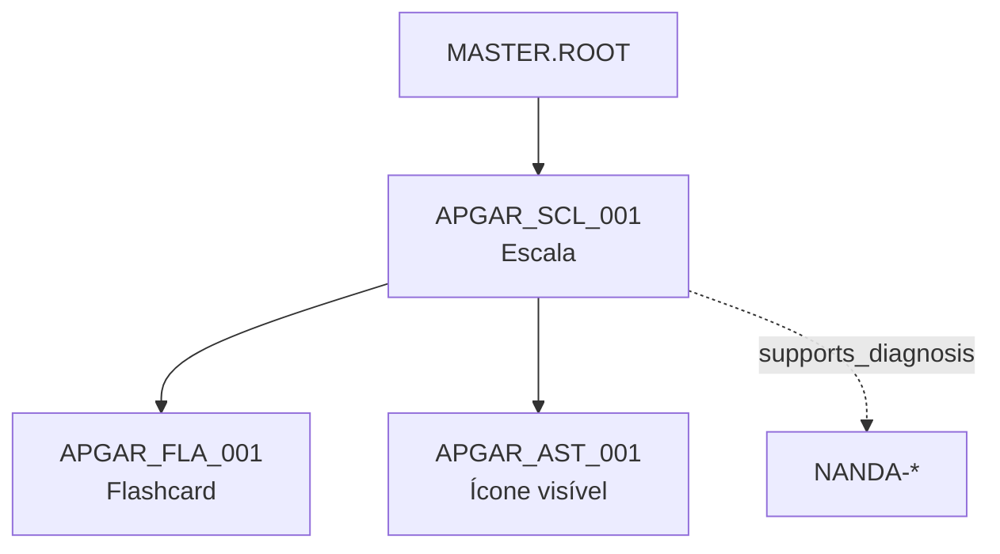

# 14 — Sequência de códigos Master Data (REVISÃO v2026.2.2)

> **Status: `APPROVED`** — aprovado por **Leivis** em 2026-06-21.

**Aprovar na plataforma:** [http://localhost:5175/code-sequence](http://localhost:5175/code-sequence) (checklist + botão)  
**CLI:** `python scripts/code_sequence/approve_proposal.py --approve --approver "Nome" --all-checks`

Artefato: [`datasets/metadata/master_code_sequence_proposal.json`](../datasets/metadata/master_code_sequence_proposal.json)  
Grafo / inferência: [doc 15](15-master-data-grafo-inferencia.md)  
Script: `python scripts/draft_master_code_sequences.py`  
Fonte do catálogo: [`website/pt/sitemap.xml`](../website/pt/sitemap.xml) (`ferramentas/*`) + `clinical_tools_catalog.json`

---

## 1. Novo padrão — tudo orbita o **conceito da ferramenta**

```
{CONCEITO}_{ARTEFATO}_{NNN}
```

| Parte | Regra | Exemplo |
|-------|-------|---------|
| **CONCEITO** | Nome inglês da ferramenta, MAIÚSCULO | `APGAR`, `BRADEN`, `DRIP_RATE` |
| **ARTEFATO** | 3 letras — tipo de entrega | `SCL`, `CAL`, `FLA` |
| **NNN** | Sequencial 001–999 por par CONCEITO+ARTEFATO | `001` |

### Exemplos aprovados para revisão

| entity_code | Significado |
|-------------|-------------|
| `APGAR_SCL_001` | Escala de Apgar (página `/ferramentas/apgar/`) |
| `APGAR_FLA_001` | Flashcards do Apgar (derivado, `parent_entity_code` → SCL) |
| `BRADEN_SCL_001` | Escala de Braden |
| `DRIP_RATE_CAL_001` | Calculadora de gotejamento |
| `BMI_CAL_001` | Calculadora de IMC |

---

## 2. Separação SCL × CAL (sem mistura)

| Sufixo | Uso | Relação |
|--------|-----|---------|
| **SCL** | Escalas e instrumentos clínicos validados | Nó principal do conceito quando for escala |
| **CAL** | Calculadoras (dose, fórmula, conversão, protocolo numérico) | **Não** é filho de SCL — liga via **EntityRelation** |
| **FLA** | Flashcards / decks | `parent_entity_code` → `{CONCEITO}_SCL_001` |
| **QIZ** | Quizzes | idem |
| **SIM** | Simulados | idem ou standalone |
| **AST** | Ícone/imagem (thumbnail visível) | `parent_entity_code` → conceito |
| **PRT** | Protocolos / checklists (sem fórmula numérica) | `9RIGHTS_PRT_001` |
| **ART** | Artigos biblioteca | `canonical_url` do sitemap legacy |

**Regra crítica:** CAL → SCL **somente edge layer** (`implements`, `assesses`) — nunca duplicar escala como calculadora.  
**Sem entidade REL:** arestas em JSON separado — ver [doc 15](15-master-data-grafo-inferencia.md).

---

## 3. Catálogo gerado a partir do sitemap

| Métrica | Valor |
|---------|-------|
| Ferramentas no sitemap (`/ferramentas/*`) | **100** |
| Conceitos únicos | **100** |
| Códigos SCL (escalas) | **40** |
| Códigos CAL (calculadoras) | **50** |
| Códigos PRT (protocolos) | **10** |
| Códigos FLA (flashcards planejados) | **40** |
| **Total de entity_codes propostos** | **140** |

Cada registro inclui:
- `canonical_url` — URL de produção (`calculadorasdeenfermagem.com.br`)
- `legacy_tool_code` / `legacy_uuid` — vínculo NKOS atual
- `evidence_grade_required: "A"`

---

## 4. Hierarquia do grafo (exemplo Apgar)



Calculadora de gotejamento (conceito distinto):

```
DRIP_RATE_CAL_001  →  MASTER.ROOT (sem SCL irmão)
```

---

## 5. Outras ferramentas do site (lógica estendida)

Além das 100 ferramentas interativas, o sitemap legacy inclui conteúdo que recebe o **mesmo padrão de conceito**:

| Área sitemap | Sufixo | Exemplo conceito |
|--------------|--------|------------------|
| `/ferramentas/{slug}/` | SCL ou CAL | `BRADEN_SCL_001` |
| `/flashcards/deck-*` | FLA | `NANDA_FLA_001` |
| `/simulados/*` | SIM | `PCR_SIM_001` |
| `/biblioteca/*` | ART | `BRADEN_ART_001` |
| `/calculadoras-trabalhistas/*` | CAL | `OVERTIME_CAL_001` |

Todo conteúdo gerado (NKOS, site estático, plataforma) **deve referenciar** `canonical_url` + `entity_code`.

---

## 6. Evidência Grau A (obrigatória)

Antes de `status: published`:

- Fonte primária peer-reviewed ou guideline internacional
- `provenance.evidence_grade: "A"`
- DOI/URL oficial documentado
- Validador CI ≥99% contra crosswalk

Sem Grau A → permanece `draft` (não aparece em pickers).

---

## 7. Amostra SCL (primeiros 10)

| entity_code | Nome | URL |
|-------------|------|-----|
| `APGAR_SCL_001` | Apgar Score | `/ferramentas/apgar/` |
| `BRADEN_SCL_001` | Braden Scale | `/ferramentas/braden/` |
| `GLASGOW_SCL_001` | Glasgow Coma Scale | `/ferramentas/gcs/` |
| `MORSE_SCL_001` | Morse Fall Scale | `/ferramentas/morse/` |
| `NEWS2_SCL_001` | NEWS2 | `/ferramentas/news2/` |

Lista completa: `sequences.SCL` no JSON.

---

## 8. Checklist de revisão

- [x] Padrão `{CONCEITO}_{ARTEFATO}_{NNN}` aprovado
- [ ] Separação SCL/CAL/PRT + edge layer (sem REL entity) aprovada
- [ ] `9RIGHTS_PRT_001` (não CAL) conferido
- [ ] Flashcards `*_FLA_001` por escala aprovados
- [ ] Mapeamento slug→conceito revisado (ex. `gcs`→`GLASGOW`)
- [ ] URLs sitemap conferidas
- [x] Aprovador: Teste Auto Data: 2026-06-21

**Após aprovação:** `"status": "APPROVED"` no JSON → iniciar migração.

→ Regenerar: `python scripts/draft_master_code_sequences.py`

→ **Piloto validação APGAR (0→100%):** [master-data/apgar/README.md](master-data/apgar/README.md)

→ **Conteúdos pendentes (FLA, SIM, MMP, PRT, PKT, FAQ):** [master-data/content-pending/README.md](master-data/content-pending/README.md)

→ **Site Full (1 comando):** [master-data/site-full/README.md](master-data/site-full/README.md)

→ **Expansão Global (195 países, 30 idiomas, fusos, 4 perfis Grau A):** [master-data/global-expansion/README.md](master-data/global-expansion/README.md)

→ **Resource Expansion (CV, escalas, indicadores, dicionário, biblioteca, slides, games):** [master-data/resource-expansion/README.md](master-data/resource-expansion/README.md)
