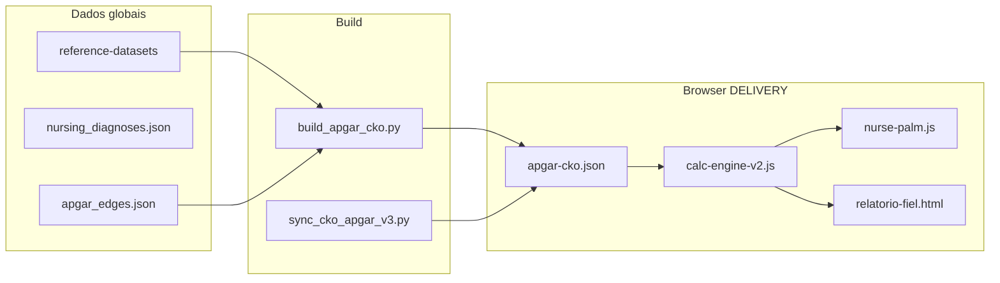

# Arquitetura da plataforma clínica

Visão consolidada alinhada à proposta de arquitetura em camadas (NIFS + CKO + CIR + Runtime) e ao estado **real** do repositório em julho/2026.

A especificação formal permanece em `NIFS/`. Este documento é o guia operacional para decisões de implementação.

## Visão alvo (Nurse-PaLM / NIS)

```
┌─────────────────────────────────────────────────────────────────┐
│                    Presentation Layer (Web/PDF)                    │
│  HTML, partials, calc-engine, perfis CKO, relatório, i18n       │
└────────────────────────────┬────────────────────────────────────┘
                             │ lê
┌────────────────────────────▼────────────────────────────────────┐
│              Clinical Intelligence Runtime (CIR)                 │
│  Inferência: scores → NANDA/NIC/NOC → plano → segurança         │
│  (hoje: heurísticas no browser; alvo: motor servidor + grafo)   │
└────────────────────────────┬────────────────────────────────────┘
                             │ compila a partir de
┌────────────────────────────▼────────────────────────────────────┐
│           NIFS Compiler + Terminology Service                    │
│  CKO por ferramenta + datasets globais → artefatos versionados  │
└────────────────────────────┬────────────────────────────────────┘
                             │ referencia
┌────────────────────────────▼────────────────────────────────────┐
│              Global Knowledge Layer (datasets)                   │
│  Terminologia, ontologia, medicamentos, regulatório, i18n keys   │
└─────────────────────────────────────────────────────────────────┘
```

**Princípio anti-duplicação:** dados clínicos e terminológicos vivem **uma vez** em `reference-datasets/` (e futuramente em `datasets/` canônico unificado). Ferramentas (Apgar, Glasgow, …) recebem apenas **particularizadores**: regras de score, thresholds, ligações ao grafo e textos de perfil — não cópias de NANDA/NIC/NOC inteiras.

## Camadas — estado honesto

| Camada | Alvo NIFS | O que existe hoje | Lacuna principal |
|--------|-----------|-------------------|------------------|
| **Global datasets** | NIFS-400, terminologia | `NIFS/reference-datasets/` (~90 JSON), `global/languages.json` | Sem pipeline único de validação/schema; alguns JSON duplicados em `DELIVERY/js/modules/data/` |
| **CKO (Clinical Knowledge Object)** | NIFS-300, perfis por ferramenta | `CKO-APGAR-001.json` v3 + `apgar-cko.json`; schema `cko-v1` | Só Apgar; `apgar-edges.json` carrega mas **não alimenta inferência** |
| **NIFS Compiler** | Gera SQL, OpenAPI, FHIR | Não implementado | Tudo manual / scripts pontuais |
| **CIR (Clinical Intelligence Runtime)** | NIFS-600 | `calc-engine-v2.js`, `nurse-palm.js` (heurístico browser) | Sem motor servidor; sem grafo; edges desconectados |
| **Knowledge Graph** | NIFS-500, Neo4j | `knowledge-graph.js`, `graph-clinical.js` (UI) | Sem banco de grafo; dados estáticos |
| **Presentation** | NIFS-900 | `NIFS/DELIVERY/` ~70% do chrome; piloto Apgar completo | PDF parcialmente ligado; API relatório não no botão Imprimir |
| **Interoperability** | NIFS-800, FHIR | `report-payload.js`, `api/report_server.py` | Export FHIR real inexistente |
| **i18n** | Locales + localização CKO | `i18n-pipeline/` (29 idiomas site legado); DELIVERY pt/en/es | Conteúdo clínico ainda duplicado por página/idioma em vez de `localization` no CKO/CIR |
| **AI (Nurse-PaLM)** | NIFS-700 | Texto gerado por regras + templates no browser | Sem modelo; sem RAG sobre datasets |

## Fluxo de dados (Apgar — piloto atual)



**Problema conhecido:** o motor lê score e perfis do CKO, mas as arestas clínicas (`apgar-edges.json`) não participam da cadeia de inferência — o Nurse-PaLM usa lógica fixa no JS.

## CKO 3.0 — contrato mínimo

Cada ferramenta deve expor um objeto versionado (`CKO-{TOOL}-{seq}.json`) com:

| Bloco | Função | Fonte preferencial |
|-------|--------|-------------------|
| `meta` | id, versão, idioma default | Particularizador |
| `calculator` | inputs, fórmula, faixas | Particularizador + refs LOINC/SNOMED |
| `profiles` | conteúdo por persona (urgência, estudante…) | Particularizador |
| `clinical_links` | IDs para NANDA/NIC/NOC no dataset global | **Somente referências**, não texto completo |
| `localization` | `pt-BR`, `en`, `es`, … | Traduções por chave, não HTML duplicado |
| `edges` | ligações ao grafo | `ontology/*_edges.json` |

O runtime UI (`apgar-cko.json`) é **artefato derivado**, regenerado por `sync_cko_apgar_v3.py` — nunca editar manualmente em produção.

## Presentation — componentes reutilizáveis

| Componente | Arquivo | Reutilizável? |
|------------|---------|---------------|
| Shell site | `partials/header.html`, `footer.html` | Sim — todas as calculadoras |
| Motor cálculo | `calc-engine-v2.js` | Sim — via `#tool-config` + CKO |
| Perfis CKO | `tool-cko-loader.js`, `tool-profile-engine.js` | Sim — por `data-cko-id` |
| Fluxo clínico | `#calcClinicalFlow` + `cognitive-ui.js` | Sim — IDs estáveis no DOM |
| PDF | `partials/relatorio-fiel.html`, `populatePrintReport()` | Sim — requer IDs conectados |
| Contexto paciente | `patient-context-storage.js` | Sim — localStorage |
| i18n runtime | `lang-selector.js`, `i18n-loader.js` | Sim — migrar para chaves + JSON |

## API de relatório (opcional)

```
POST /generate-report  →  HTML idêntico ao template PDF
```

Código em `NIFS/DELIVERY/api/`. O browser monta o mesmo payload via `report-payload.js`. **Pendente:** ligar o botão Imprimir à escolha entre `window.print()` e POST à API.

## Internacionalização na arquitetura

Três camadas de texto — **não misturar**:

1. **Chrome global** (menu, footer, botões, acessibilidade): dicionário único, 29 idiomas, pipeline `i18n-pipeline/` → futuro `i18n/global/{lang}.json`.
2. **Terminologia clínica** (NANDA, NIC, NOC, nomes de escalas): dataset global com `localized_label` por locale — traduzir **uma vez**.
3. **Particularizador por ferramenta** (dicas de perfil, interpretação específica): bloco `localization` no CKO — traduzir por ferramenta, reutilizando chaves globais quando possível.

Evitar: 97 cópias de `nanda.json` embutidas em cada HTML traduzido.

## Decisões implícitas (alinhadas ao ChatGPT / NIFS)

| Decisão | Direção |
|---------|---------|
| Fonte da verdade | NIFS spec + `reference-datasets/`, não o HTML |
| HTML/PDF | Artefatos de apresentação gerados ou populados em runtime |
| Particularizadores | Pequenos, versionados, por ferramenta (CKO) |
| Globais primeiro | Terminologia e ontologia antes de escalar calculadoras |
| i18n | Chaves e datasets, não páginas estáticas × 29 idiomas |
| Runtime | Evoluir browser → API + grafo sem reescrever datasets |

## Referências no repositório

- Especificação: `NIFS/README.md`
- Estrutura de pastas: [ESTRUTURA-REPOSITORIO.md](./ESTRUTURA-REPOSITORIO.md)
- Roadmap: [PLANO-FASEADO.md](./PLANO-FASEADO.md)
- i18n pendências: `i18n-pipeline/PENDENCIAS_I18N.md`
